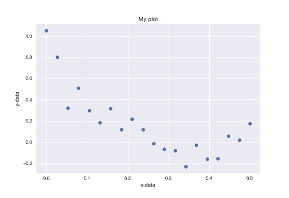

## Description
Non-linear curve fitting is a fundamental part of the quantitative analysis performed in multiple scientific disciplines.
The main idea is that we know (or assume) the model that describes an observed data.
For example, we could observe a signal like the following:

We could assume that the data is described by a number of different models, but an exponential decay is reasonable option. Thus if we assumed our dat is described by the following model:

$$ signal = M_z  \exp(-xdata/T_1) $$