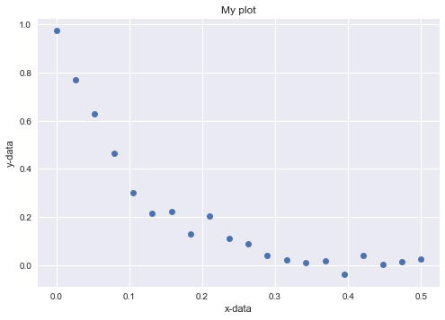

## Description

Non-linear curve fitting is a fundamental part of the quantitative analysis performed in multiple scientific disciplines.
The main idea is that we know (or assume) the model that describes an observed data.
For example, we could observe a signal like the following:


We could assume that the data is described by a number of different models, but an exponential decay is reasonable option. Thus if we assumed our dat is described by the following model:

$$ f(Mz,T1,xdata) = Mz * \exp(-xdata/T1) $$

The question now becomes how to determine the values of 'Mz' and 'T1' knowing the observed data and the assumes model. This is what we do:

> Find the Mz and T1 that minimize the sum of squares of the residuals beween the observed data and the assumed model. This method is called least-squares curve fitting.

In other words, we "calculate" the signal at multiple Mz and T1 and find the one that minimizes the objetive function described above:

$$ \sum( [f(Mz,T1) - Ydata]^2) $$

## How do we do this in Python?


```python
# Load modules
import matplotlib.pyplot as plt
import numpy as np
import seaborn as sn
```


```python
# create artificial data set + npise
xdata=np.linspace(0,.5,20)
ydata= np.exp(-xdata/0.10);
ydata = ydata + np.random.normal(0, .05, 20)
```


```python
# plot
plt.plot(xdata,ydata,'o')
plt.xlabel('x-data'); plt.ylabel('y-data'); plt.title("My plot")
plt.show();
```





```python

```
